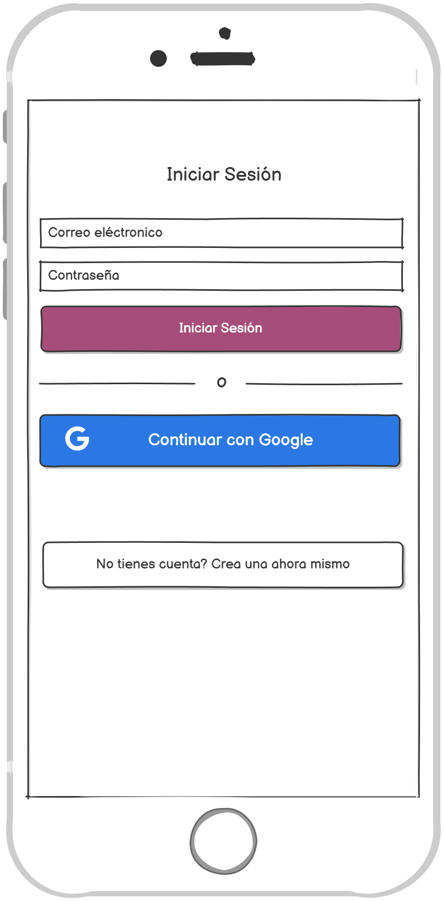
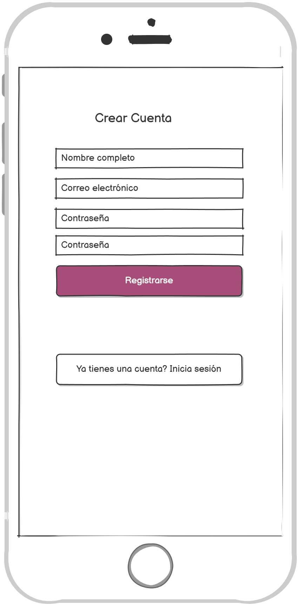
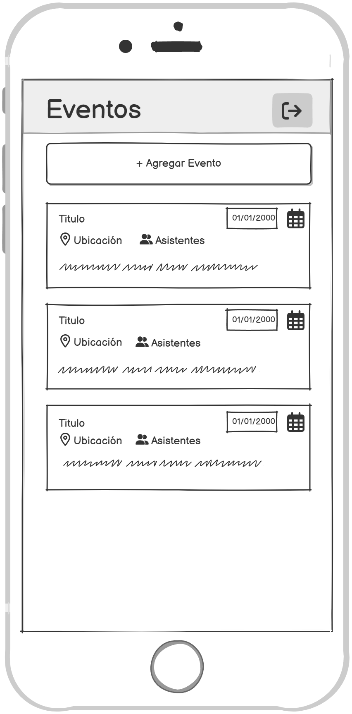

## Proyecto Eventos-Comunitarios
Aplicación móvil desarrollada en React Native para permitir a una comunidad local gestionar eventos y actividades comunitarias.

## 🎨 Mockups

1. Login
   
2. Register
   
3. Eventos
   
4. Crear evento
   
5. Descripción de evento
   
6. Editar evento
   
7. Eliminar evento
   

---

## 🚀 Tecnologías

- [React Native](https://reactnative.dev/)
- [Expo Router](https://expo.dev/router)
- [Firebase (Firestore & Auth)](https://firebase.google.com/)
- [React Native Calendars](https://github.com/wix/react-native-calendars)
- [React Native Flash Message](https://github.com/luckyseven/react-native-flash-message)

---

## 📦 Requisitos previos

- Node.js ≥ 18.x
- Expo CLI (`npm install -g expo-cli`)
- Una cuenta de Firebase con un proyecto creado
- Archivo `firebase.ts` con la configuración de Firebase dentro de `config/`

---

## Guia de Instalación 💻

1. Seleccionar una carpeta de su equipo local donde clonará y almacenará el repositorio
2. Una vez seleccionada la carpeta, abra "Git Bash" y ejecute el comando git clone https://github.com/ManuelGamez/ProyectoDSM2021.git Esto le permitirá conectarse de una vez al repositorio.

3. Crear una rama de colaboración para poder agregar los cambios realizados a Github.

4. Una vez este conectado al repositorio y haya creado su rama, puede comenzar a colaborar desde su equipo local, para lo que será necesario abrir el proyecto.

5. Ejecute el comando "npn install" para instalar las dependencias necesarias para ejecutar el proyecto.

6. Ejecute el comando "npx expo start" para iniciar el proyecto, puede ejecutar "npx expo start --web" para ejecutarlo en su navegador web o escanear el código QR para ejecutarlo desde su teléfono celular.

7. Realice las modificaciones necesarias y ejecute los comandos: git add -A para agregar los cambios, git commit -m "comentario" y finalmente git push -u origin SuRama para agregar los cambios al repositorio remoto.

---

## 👥 Integrantes

Carlos Adalberto Campos Hernández - CH222748

José Valentín Corcios Segovia - CS232913

Ludwin Enrique Martínez Alfaro - MA222763

Fernando Samuel Quijada Arévalo - QA190088

---

## Licencia 📄
Este proyecto está bajo la licencia Atribución-NoComercial-CompartirIgual 4.0 Internacional (CC BY-NC-SA 4.0) Que establece:

Usted es libre de: Compartir — copiar y redistribuir el material en cualquier medio o formato Adaptar — remezclar, transformar y construir a partir del material La licenciante no puede revocar estas libertades en tanto usted siga los términos de la licencia

## Enlaces de interés 👀
[Tablero en Trello] https: [Por Agregar]
[Manual de usuario en la nube] - https: [Por Agregar]
[Video de funcionamiento] - https: [Por Agregar]
[Enlace a Mockups] - https: [Por Agregar]