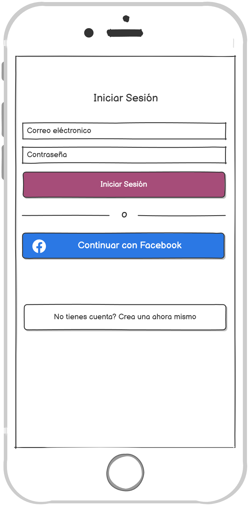

## Proyecto Eventos-Comunitarios
Aplicación móvil desarrollada en React Native para permitir a una comunidad local gestionar eventos y actividades comunitarias.

## 🎨 Mockups

1. Login  
   
2. Register  
   
3. Eventos  
   
4. Crear evento  
   
5. Descripción de evento  
   
6. Editar evento  
   
7. Eliminar evento  
   

---

## 🚀 Tecnologías

- [React Native](https://reactnative.dev/)
- [Expo Router](https://expo.dev/router)
- [Firebase (Firestore & Auth)](https://firebase.google.com/)
- [React Native Calendars](https://github.com/wix/react-native-calendars)
- [React Native Flash Message](https://github.com/luckyseven/react-native-flash-message)

---

## 📦 Requisitos previos

- Node.js ≥ 18.x
- Expo CLI (`npm install -g expo-cli`)
- Una cuenta de Firebase con un proyecto creado
- Archivo `firebase.ts` con la configuración de Firebase dentro de `config/`

---

## Guia de Instalación 💻

1. Seleccionar una carpeta de su equipo local donde clonará y almacenará el repositorio
2. Una vez seleccionada la carpeta, abra "Git Bash" y ejecute el comando `git clone https://github.com/ManuelGamez/ProyectoDSM2021.git`
3. Crear una rama de colaboración para poder agregar los cambios realizados a Github.
4. Una vez esté conectado al repositorio y haya creado su rama, puede comenzar a colaborar desde su equipo local.
5. Ejecute el comando `npm install` para instalar las dependencias necesarias.
6. Ejecute `npx expo start` para iniciar el proyecto, `npx expo start --web` para navegador o escanee el QR en su celular.
7. Realice los cambios y use:
   - `git add -A`
   - `git commit -m "comentario"`
   - `git push -u origin SuRama`

---

## 👥 Integrantes

- Carlos Adalberto Campos Hernández - CH222748  
- José Valentín Corcios Segovia - CS232913  
- Ludwin Enrique Martínez Alfaro - MA222763  
- Fernando Samuel Quijada Arévalo - QA190088  

---

## Licencia 📄

Este proyecto está bajo la licencia **Atribución-NoComercial-CompartirIgual 4.0 Internacional (CC BY-NC-SA 4.0)**.  
Usted es libre de:  
- **Compartir** — copiar y redistribuir el material en cualquier medio o formato  
- **Adaptar** — remezclar, transformar y construir a partir del material  
La licenciante no puede revocar estas libertades en tanto usted siga los términos de la licencia.

---

## Enlaces de interés 👀

- [Tablero en Trello] - https://trello.com/invite/b/68367e9994ddd7e64455f976/ATTIce0630d5d8240bb515a0264db9e38008141B74C5/proyecto-dps  
- [Manual de usuario en la nube] - https://[Por Agregar]  
- [Video de funcionamiento] - https://[Por Agregar]  
- [Enlace a Mockups] - https://balsamiq.cloud/srifj34/pugqnwh  
